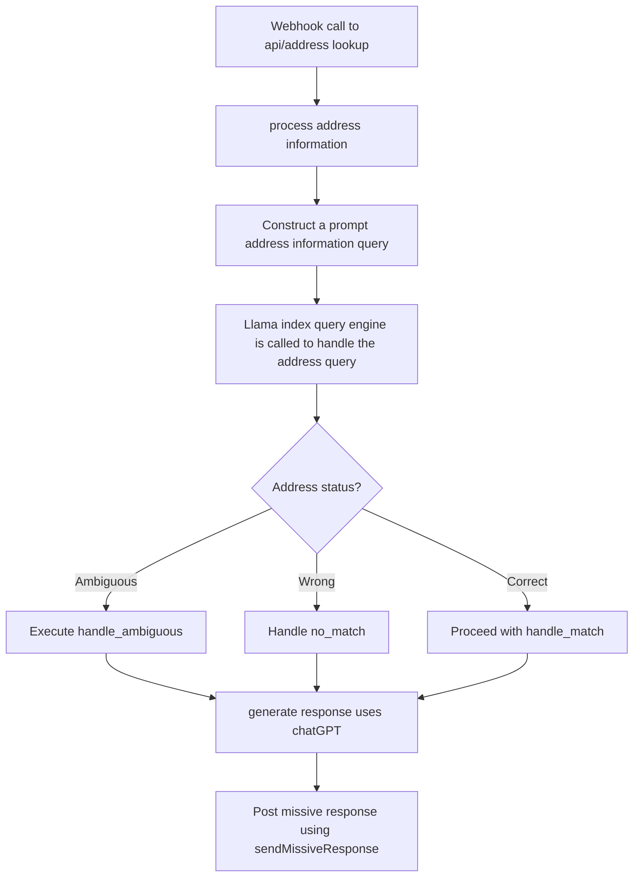

# Address Lookup System

## Overview
This system provides an automated address lookup service, integrating database queries, natural language processing, and communication APIs to deliver detailed property information and manage user interactions.
## API Overview

This API provides various endpoints for managing conversations, broadcasts, and data lookups. It's built using Flask and integrates with services like Missive and Twilio.

## Key Features
- Address search and validation
- Property information retrieval (ownership, tax status, rental status)
- Conversation tracking and summarization

## Endpoints

### POST /search
Purpose: Searches for property information based on a given address.

Request Body:
- `conversation`: Object containing conversation details.
- `message`: Object containing message details, including the address to search.

Response: Returns property information if found, or appropriate error messages.

### POST /yes
Purpose: Confirms and processes a property lookup based on the latest address in a conversation.

Request Body:
- `conversation`: Object containing conversation details.
- `message`: Object containing message details.

Response: Returns success message or error details.

### POST /more
Purpose: Retrieves additional information about a property, including tax and rental status.

Request Body:
- `conversation`: Object containing conversation details.
- `message`: Object containing message details.

Response: Returns additional property information or error details.

### GET /fetch_property
Purpose: Initiates a background job to fetch property data.

Response: Returns a message indicating that the data fetch has started.

### GET /fetch_rental
Purpose: Initiates a background job to fetch rental data.

Response: Returns a message indicating that the data fetch has started.

### GET /weekly_report
Purpose: Generates and sends a weekly analytics report.

Response: Returns a message confirming that the weekly report was sent.

### GET /conversations/<conversation_id>
Purpose: Retrieves detailed information about a specific conversation.

Query Parameters:
- `reference`: Phone number reference for the conversation.

Response: Returns conversation data including assignees, labels, and summaries.

### PATCH /contacts/<phone_number>
Purpose: Updates contact information for a given phone number.

Request Body:
- `email`: (optional) New email address for the contact.
- `zipcode`: (optional) New zipcode for the contact.

Response: Returns a success message or error details.

## Database Schema

Our application uses a PostgreSQL database with the following main tables:

### MiWayneDetroit (address_lookup schema)
Stores detailed property information for Wayne County, Detroit. It includes:
- Geographic data (wkb_geometry)
- Parcel information (parcelnumb, tax_id)
- Property details (zoning, structure info, value)
- Owner information
- Address details
- Tax information

### ResidentialRentalRegistrations (address_lookup schema)
Contains information about registered rental properties:
- Geographic data (wkb_geometry)
- Registration details (record_id, date_status)
- Address information

### LookupHistory
Tracks the history of address lookups:
- Address
- Zip code
- Tax status
- Rental status

### LookupTemplate (public schema)
Stores templates for lookup responses:
- Template name
- Content
- Type

### WeeklyReport
Stores weekly analytics data:
- Conversation metrics
- User satisfaction metrics
- Property status counts
- Reply and unsubscribe statistics by user segment

### Author
Stores information about message authors:
- Phone number (primary key)
- Name
- Unsubscribe status
- Zipcode
- Email

### TwilioMessage
Records details of messages sent via Twilio:
- Message preview
- Delivery information
- References to other messages
- Broadcast reply status

### ConversationLabel
Links conversations to labels:
- Conversation ID
- Label ID
- Update timestamp
- Archive status

### ConversationAssignee
Tracks the assignment and status of conversations:
- Various status flags (unassigned, closed, archived, etc.)
- Conversation ID
- User ID of assignee

### User
Stores user information:
- User ID (UUID)
- Email
- Name
- Avatar URL

### Comments
Stores comments and tasks related to conversations:
- Comment body
- Creation and completion timestamps
- Associated user and conversation
- Task status

### Flowchart


  
## Docker Quick Start

```bash
docker build -t lookup .
docker run -p 5000:5000 --name lookup_app --restart unless-stopped lookup
```

## Setup
### Prerequisites

- Python 3.x
- Docker (for containerized deployment)
- Supabase account (for pg_cron extension)

### Cron Job Initialization
The script `scripts/init_cron.py` initializes cron jobs using the [pg_cron extension](https://supabase.com/docs/guides/database/extensions/pg_cron) of Supabase. 
These cron jobs are scheduled to run at 00:00 on the first day of every month.
To initialize the cron jobs, run the following command:

```sh
python -m scripts.init_cron
```
